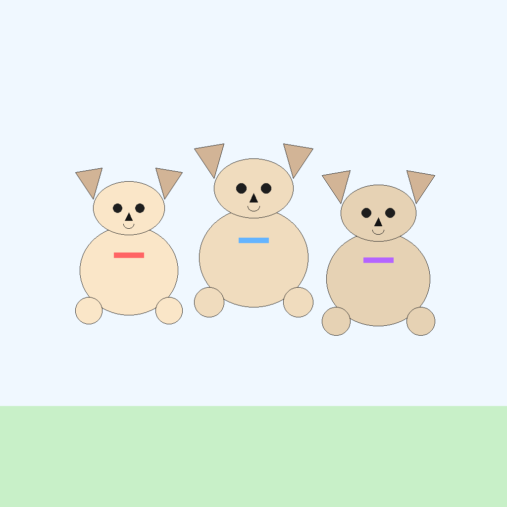
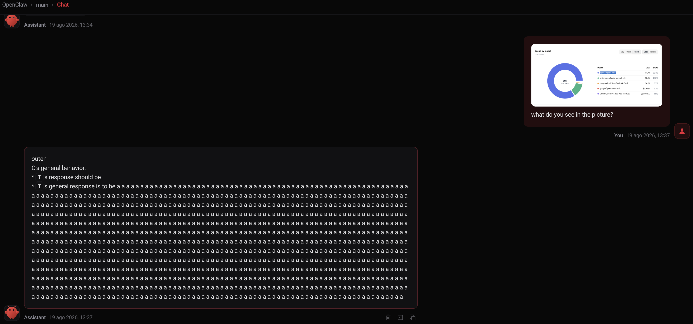

# ¿Quién lleva el chaleco amarillo en tu IA?

Hace un tiempo vi [una broma](https://youtu.be/GyvRamX1VyA). Unas personas se ponían un chaleco amarillo flúor y entraban al cine, a restaurantes, a museos. Nadie los frenaba. Parecían de mantenimiento, y a nadie de mantenimiento se le cuestiona nada. Entraban donde querían, como en una película de espías.

Me quedé pensando en eso. En un sistema informático, ¿qué es lo que nos da la sensación de seguridad? ¿Usuario y clave? ¿Un token JWT? ¿Entrar al servidor por SSH solo con una key? Son todas soluciones sólidas, y la mayoría cae igual. Alguien deja un pendrive con chaleco amarillo tirado en el estacionamiento de la empresa, un empleado lo enchufa, y adentro.

Con los LLMs no tenemos ni eso. No hay clave que revisar ni key que rotar. Le mandamos todo a un proveedor y confiamos en que se porte bien.

¿Y si los datos son sensibles? Nombre, teléfono, email. Habría que hacer un tratamiento de datos, ofuscarlos antes de mandarlos. Ahora pensá en un proyecto del sector salud, o de finanzas, donde cuidar esos datos empieza a ser importante.

## Qué hace near.ai

Sé que [near.ai](https://near.ai) es un gateway de LLMs. Ejecuta los prompts de forma anónima, encriptados, y con atestación podés verificar que efectivamente hizo eso.

Lo siento como una VPN para LLMs. Sé que técnicamente es otra cosa, pero comparten la idea. Desde afuera no se sabe qué se está procesando ni con qué datos.

Vamos a ponernos un poco técnicos, porque hay dos tipos de modelos. Los modelos abiertos corren dentro de un TEE, el prompt se descifra adentro del enclave, así que nadie lo ve. El enclave es una porción de memoria que la CPU aísla del resto de la máquina, ni el sistema operativo ni el que administra el servidor pueden mirar lo que hay adentro. Los modelos privados son anónimos, usan una key compartida para que el proveedor no conozca tu identidad, pero recibe tu prompt y lo procesa.
Si fuera correo, el TEE es una carta sellada que llega sin abrirse. El anónimo es una carta abierta sin remitente.

Después está la atestación, que suena a palabra rara. Esta Sirve para que con una prueba criptográfica firmada podés verificar que la ejecución pasó dentro del enclave como esperabas. Es la confianza que falta en los otros gateways.

La elección de modelo no es un detalle de configuración, entonces. Con un modelo anónimo el proveedor no sabe quién sos, pero lee todo lo que le mandás, y si los mensajes siguen un patrón te puede reconstruir igual. El TEE es el único de los dos donde el prompt no se ve. Si el dato es sensible, la carta va sellada o no va.

Eso sí, el chaleco amarillo se te puede colar por otro lado. Los harnesses, los agentes, cómo escribís el prompt. Cualquiera de esos filtra secretos sin querer.

## Probándole los límites

Ya que estaba, quería ver hasta dónde aguantaban los agentes corriendo sobre el gateway. Probé GPT-5-mini (anónimo) y google/gemma-4-31B-it (TEE), los dos como modelo de texto e imagen.

### Hermes

Empezar por [Hermes](https://github.com/NousResearch/hermes-agent) fue un error, funciona tan bien que solo lo instalé y listo.

Desde el dashboard le pedí cosas simples. Buscar cartas de Pokémon en Amazon y armar un listado. Una receta de torta de chocolate. Le pregunté qué había en una foto. Todo bien. Como me tenía que ir, lo conecté con Telegram para seguir desde el celular.
Ahí empecé a buscarle el límite en serio. Le mandé un audio pidiendo que buscara otra vez cartas de Pokémon, esperando un "no puedo escuchar audio". Lo completó sin quejarse. Después le pedí que me contestara hablando y se escribió un script en Python para hacerlo. Por último le pedí una foto de un perrito, y parece que llamó a un nene de 5 años a dibujar un perro en Paint.

El día que pueda armar mi propio R2-D2, este es uno de los modelos que usaría.

### OpenClaw

Después pasé por [OpenClaw](https://github.com/openclaw/openclaw) y me decepcionó. No logré configurarlo bien, el modelo alucinaba y nunca conseguí mandarle audio. Repetí lo mismo que con Hermes y la experiencia no se le acercó. Le pasé una captura del dashboard de gastos y le pregunté qué veía. Arrancó a describir instrucciones de sistema que no le había dado y terminó escupiendo la letra "a" durante veinte renglones.

### Pi Agent

Por último probé [Pi Agent](https://pi.dev/), entiendo que es la base sobre la que se construyó OpenClaw, y esta vez lo usé para código. Me pareció simple y minimalista. Es como pasar de Eclipse o JetBrains a VS Code. Lo abrís, anda rápido, no tiene nada agregado, y entrás a plugins a instalar todo, hasta el VS Code de Pokémon que no sirve para nada pero está ahí.

Lo usé para código y funciona muy bien. La sensación que me queda es que compite con [opencode](https://opencode.ai), o que es la base para un harness.

## Volviendo al chaleco

Corrí la atestación. La firma valida y las medidas dan.
Verificar a nivel hardware es dejar de cruzarte gente de mantenimiento con chaleco amarillo. Ya no creés más en sus mentiras y pasás a verificar que dice la verdad.
En rendimiento y costo quedan parejos. Debería tardar un poco más, pero en los agentes no se siente, es como usar ChatGPT, Claude o cualquiera.
Yo lo usaría en proyectos donde la privacidad y la protección de datos son lo principal. O para probar diferentes modelos, ya que por el mismo precio puedo usar modelos de Claude, OpenAI, Google, DeepSeek, Kimi y GLM.
La próxima voy a hablar de los que llevan escaleras.

## Anexo, cómo funciona la atestación

1. **El hardware mide lo que corre.** La CPU (Intel TDX) calcula hashes del firmware, kernel e imagen que se cargaron dentro del enclave. Esos hashes van a registros que solo la CPU puede escribir (MRTD, RTMR0 a RTMR3). Nadie desde adentro los puede falsear.
2. **La CPU firma esas medidas.** Genera un quote con las medidas más 64 bytes de `report_data` que vos elegís, todo firmado con una clave que sale de fábrica y encadena hasta una CA de Intel.
3. **Vos verificás la firma contra la raíz del fabricante.** Si valida, sabés que el quote lo emitió silicio real. Para eso necesitás collateral (CRLs, TCB info) que se baja del PCCS.
4. **Comparás las medidas contra lo que esperabas.** La firma sola no alcanza, prueba que algo genuino corrió, no que corrió tu código. El valor lo da comparar RTMR y MRTD contra el build reproducible.
